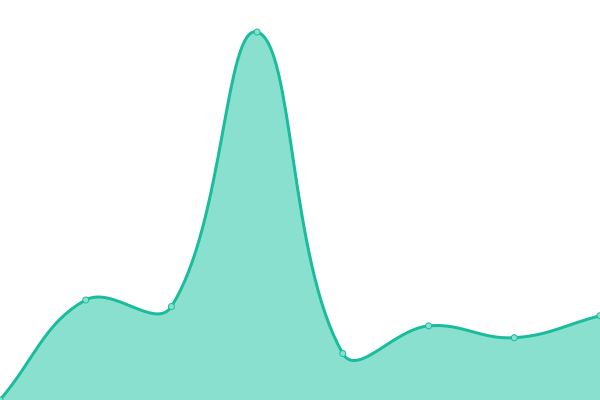
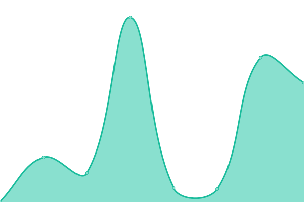

# [📈 Live Status](https://joanmarcriera.github.io/upptime): <!--live status--> **🟧 Partial outage**

This repository contains the open-source uptime monitor and status page for [Joan Marc Riera Duocastella](http://www.joanmarcriera.es/), powered by [Upptime](https://github.com/upptime/upptime).

With [Upptime](https://upptime.js.org), you can get your own unlimited and free uptime monitor and status page, powered entirely by a GitHub repository. We use [Issues](https://github.com/joanmarcriera/upptime/issues) as incident reports, [Actions](https://github.com/joanmarcriera/upptime/actions) as uptime monitors, and [Pages](https://joanmarcriera.github.io/upptime) for the status page.

<!--start: status pages-->
<!-- This summary is generated by Upptime (https://github.com/upptime/upptime) -->
<!-- Do not edit this manually, your changes will be overwritten -->
<!-- prettier-ignore -->
| URL | Status | History | Response Time | Uptime |
| --- | ------ | ------- | ------------- | ------ |
|  [EBI HTTP](http://ftp.ebi.ac.uk/robots.txt) | 🟩 Up | [ebi-http.yml](https://github.com/joanmarcriera/upptime/commits/HEAD/history/ebi-http.yml) | 

 779ms
     
 | 

<a href="https://joanmarcriera.github.io/upptime/history/ebi-http">99.67%</a>
    

|  [EBI HTTPS](https://ftp.ebi.ac.uk/robots.txt) | 🟥 Down | [ebi-https.yml](https://github.com/joanmarcriera/upptime/commits/HEAD/history/ebi-https.yml) | 

 590ms
     
 | 

<a href="https://joanmarcriera.github.io/upptime/history/ebi-https">99.17%</a>
    

|  [EBI FTP](ftp://ftp.ebi.ac.uk/robots.txt) | 🟩 Up | [ebi-ftp.yml](https://github.com/joanmarcriera/upptime/commits/HEAD/history/ebi-ftp.yml) | 

 1342ms
     
 | 

<a href="https://joanmarcriera.github.io/upptime/history/ebi-ftp">99.79%</a>
    

|  [Wikipedia](https://en.wikipedia.org) | 🟩 Up | [wikipedia.yml](https://github.com/joanmarcriera/upptime/commits/HEAD/history/wikipedia.yml) | 

 129ms
     
 | 

<a href="https://joanmarcriera.github.io/upptime/history/wikipedia">100.00%</a>
    

|  [Hacker News](https://news.ycombinator.com) | 🟩 Up | [hacker-news.yml](https://github.com/joanmarcriera/upptime/commits/HEAD/history/hacker-news.yml) | 

 265ms
     
 | 

<a href="https://joanmarcriera.github.io/upptime/history/hacker-news">100.00%</a>
    

<!--end: status pages-->

[**Visit our status website →**](https://joanmarcriera.github.io/upptime)

## 📄 License

- Powered by: [Upptime](https://github.com/upptime/upptime)
- Code: [MIT](./LICENSE) © [Anand Chowdhary](https://anandchowdhary.com), supported by [Pabio](https://pabio.com)
- Data in the `./history` directory: [Open Database License](https://opendatacommons.org/licenses/odbl/1-0/)
